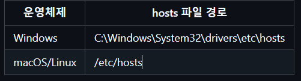

### <Nginx를 통한 Local Https 설정 + Local Domain 적용에 대한 가이드>

로컬에서만 사용할 수 있게 설계한 레포지토리입니다.   
Local Domain에 대한 인증서와 키까지 함께 올렸습니다.  
-> 즉 , 여러분들은 본인 로컬 컴퓨터의 host파일에 다음 한 줄만 추가해주시면 됩니다.

#### host 파일 에 추가할 코드
```
127.0.0.1 api.dt.com
```

#### host 파일이 있는 경로


#### 로컬 도메인이 제대로 설정되었는지에 대한 테스트
powershell에서 실행 
```
ping api.dt.com
```
여기서 다음과 같이 나오면 성공입니다.
```
Ping api.dt.com [127.0.0.1] 32바이트 데이터 사용:
127.0.0.1의 응답: 바이트=32 시간<1ms TTL=128
127.0.0.1의 응답: 바이트=32 시간<1ms TTL=128
127.0.0.1의 응답: 바이트=32 시간<1ms TTL=128
127.0.0.1의 응답: 바이트=32 시간<1ms TTL=128
```


What : Nginx를 통한 Local Https 설정 + Local Domain 적용   
When : 2025-08-04    
Who : 류성열    

<Test>
테스트 링크 : https://api.dt.com/NginxTest.html

위 링크를 브라우저에 입력할 때,
"Spring Boot 정적 리소스 테스트 성공!"라는 메시지가 나오면 성공입니다.